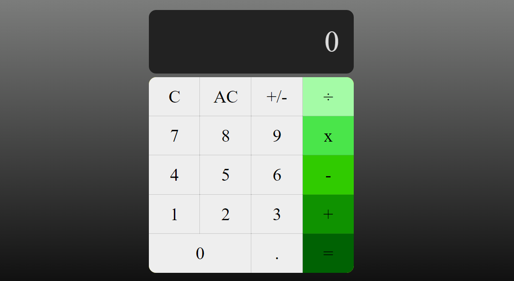

# Calculator

**About the Project**

A calculator application built with HTML, CSS, and added functionality via JavaScript and jQuery.

**Features Added**

* Basic math operations (+, -, x, /)
* Responsive design with Flexbox

**Features to Implement**

* Additional math functionality and checking user input
* Convert functionality to OOP

